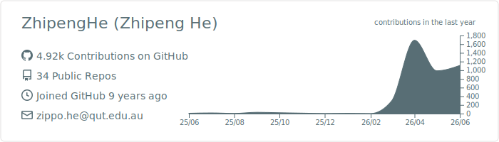
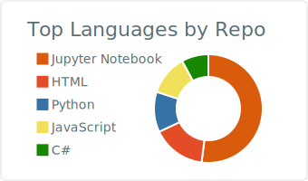
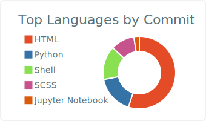
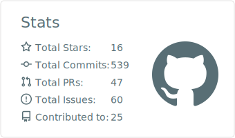
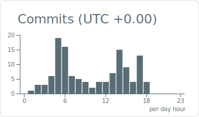

### G'day, I'm Zhipeng He (何志鹏) 👋

PhD Candidate at [Queensland University of Technology](https://www.qut.edu.au/) (QUT), Brisbane, Australia.
My research focuses on **adversarial robustness of machine learning on tabular data**, with broader interests in explainable AI and process analytics.

---

#### 📊 GitHub Stats

  

  
  

  
  

<!---
ZhipengHe/ZhipengHe is a ✨ special ✨ repository because its `README.md` (this file) appears on your GitHub profile.
You can click the Preview link to take a look at your changes.
--->
